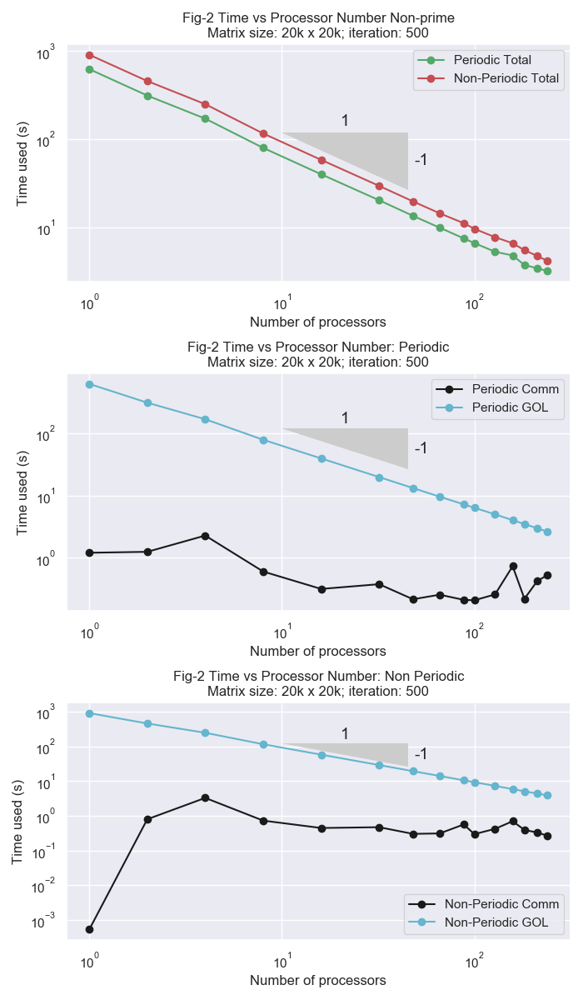
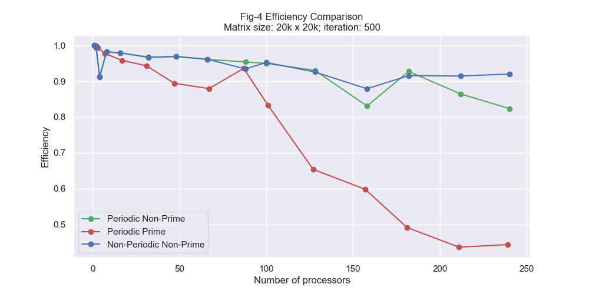
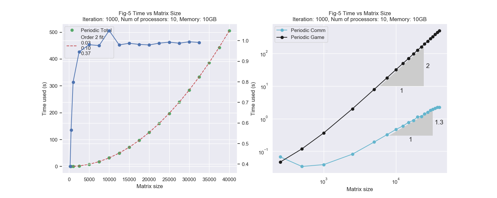

# acse-6-individual-assignment-acse-hl1319

## Basic Information

### About the code: 
* Source.cpp: main file
* Golp class: game of life class
* Store and show options are commented but relevant functions provided in the Golp class

### Compiling and Execution
* Compiling:
```mpicxx -std=c++14 -o <execution fname> Source.cpp```

* Exectution: 
```mpiexec -n <number of processors> <execution fname> <rows> <cols> <iterations> <periodic condition>```

## 1. Game of Life Example


## 2. Analysis Results


### Periodic & Non-periodic
* Both periodic and non-periodic conditions show decreasing runtime with number of processors increasing
* 

### Efficiency for prime and non-prime number of processors
* Efficiency decreases when using prime number of processors



### Domain Sizes
* Communication time increases hyperbolicly with domain size
* Efficiency of parallelisation increases with domain size
* 


